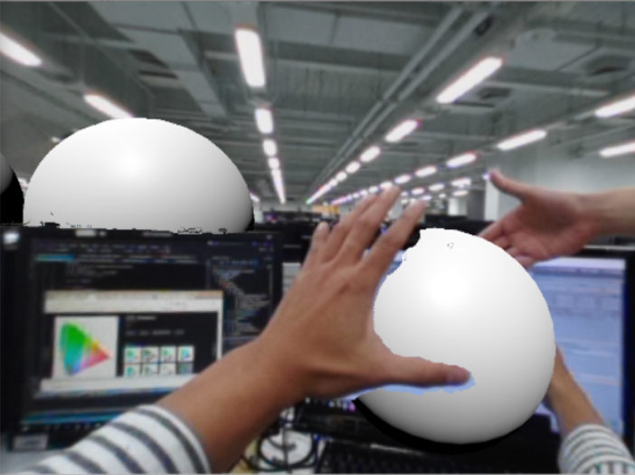
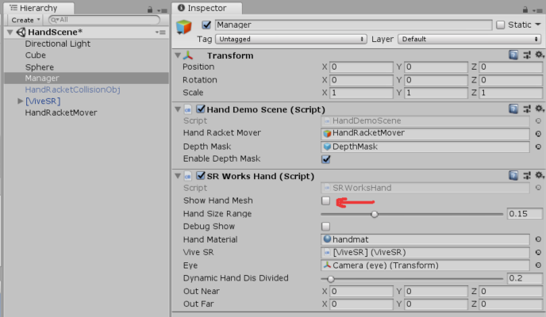
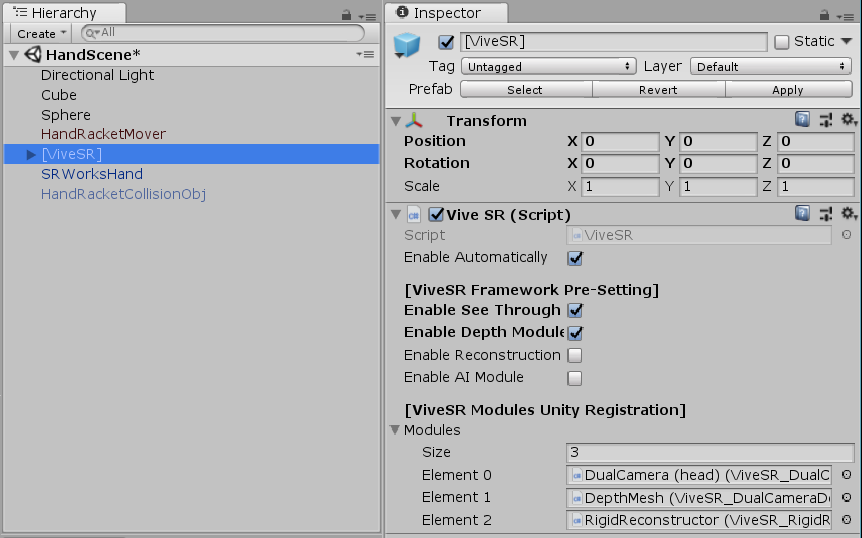

A Vive SRWorks Hand Interaction example for Unity

The example scene included shows how to occlude and interact with virtual objects (a sphere and a cube) with your hands.

- In this example, by default the occlusion is using a depth mask (you can enable/disable it in the Manager object)

- You can also view the hand's mesh instead of the occlusion depth mask by enabling it in the Manager object:

- To slap/punch (without going through the object) enable the HandRacketCollisionObj in the scene 
  (you can optionally make it visible by enabling the Mesh Renderer on it)
  

- Depth mask occlusion settings can be edited at runtime in the inspector on the DualCamera (head) object
  in addition to using the SRWorks settings in the game window that can be called up by pressing the S and R keys at the same time.
  For more info:
  http://community.viveport.com/t5/Vive-SRWorks-SDK/Use-Depth-Image-to-Occlude-Virtual-Objects-in-Unity/gpm-p/20707#M229

Requirements: 
- VIVE Pro (make sure cameras are enabled and working in settings)
- ViveSRWorks Unity package: Vive-SRWorks-0.7.5.0-Unity-Plugin.unitypackage or later versions.
Download the latest VIVE SRWorks SDK from: http://developer.vive.com/resources

Note: tested on Unity 2018.2.16f1 
  Earlier versions seems to have prefab issues on importing so the unity package was made from 2017.4

Note: as of SRWorks v0.8.0.2 the ViveSR prefab requires you to enable the modules you will be using as shown:

